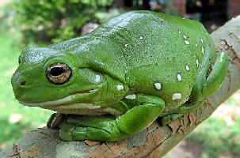
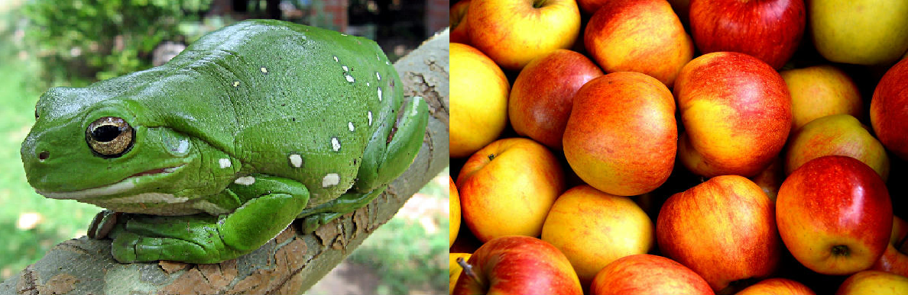

### Imagene - A General Purpose Image Manipulation Tool

## Example

```yaml
imagene frog.jpg resize:500,0 append:apple.jpg result.png
```


## Help Page
```rust
Syntax:
    imagene <infile> ...<action>:<value>... ...<flag>... <outfile>

Available Actions:
    contrast:<float>  // Increase contrast
    resize:<int,int>  // Resize an image, leave one of the ints empty to auto scale it
    append:<string>   // Add another image next to source image

Available Flags:
    shrink            // Appended images will inherit the height of the shortest

Examples:
     // Increases the contrast of the original image and adds an extra image next to it
     imagene in_file.png contrast:2 append:extra_image.png out_file.png

     // Adds an extra image next to in_file.png and new image inherit height of the smallest
     imagene in_file.png shrink append:extra_image.png out_file.png

     // Sets width to 2000 and automatically scales height to keep aspect ratio
     imagene in_file.png resize:2000,0 out_file.png

     // Overwrites an image with increased contrast
     imagene in_file.png contrast:2 in_file.png
```
